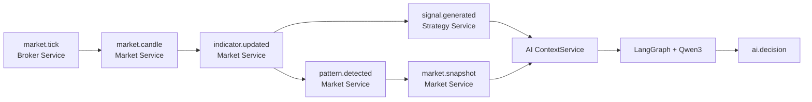

                                  ┌──────────────────────────┐
                                  │   trade-market-service   │
                                  └─────────────┬────────────┘
                                                │
                                                │ market.snapshot
                                                ▼
                                  ┌──────────────────────────┐
                                  │       Kafka Cluster       │
                                  │  market.snapshot topic    │
                                  │  signal.generated topic   │
                                  │  ai.decision topic        │
                                  └─────────────┬────────────┘
                                                │
                              ┌─────────────────┴─────────────────┐
                              │                                   │
                              ▼                                   ▼
                    ┌────────────────────┐              ┌────────────────────┐
                    │ MarketSnapshot     │              │ SignalGenerated    │
                    │ Kafka event        │              │ Kafka event        │
                    └─────────┬──────────┘              └─────────┬──────────┘
                              │                                   │
                              └─────────────────┬─────────────────┘
                                                ▼
                                  ┌──────────────────────────┐
                                  │     ContextService       │
                                  │                          │
                                  │ Cache by symbol/timeframe│
                                  │ Validate Pydantic events │
                                  │ Build unified state      │
                                  └─────────────┬────────────┘
                                                │
                                                ▼
                                  ┌──────────────────────────┐
                                  │     LangGraph Workflow    │
                                  └─────────────┬────────────┘
                                                │
                                                ▼
                                  ┌──────────────────────────┐
                                  │       Market Agent        │
                                  │ Trend, regime, levels,    │
                                  │ volatility, VWAP position │
                                  └─────────────┬────────────┘
                                                │
                                                ▼
                                  ┌──────────────────────────┐
                                  │     Technical Agent       │
                                  │ RSI, EMA, MACD, ADX, ATR,  │
                                  │ supertrend, pattern, volume│
                                  └─────────────┬────────────┘
                                                │
                                                ▼
                                  ┌──────────────────────────┐
                                  │      Strategy Agent       │
                                  │ Signal confidence and     │
                                  │ market/technical alignment│
                                  └─────────────┬────────────┘
                                                │
                                                ▼
                                  ┌──────────────────────────┐
                                  │       Decision Agent      │
                                  │                          │
                                  │ LangChain ChatOllama      │
                                  │ Model: qwen3              │
                                  │ Temperature: 0.1         │
                                  │ Output: strict JSON      │
                                  └─────────────┬────────────┘
                                                │
                                                ▼
                                  ┌──────────────────────────┐
                                  │       AIDecisionEvent     │
                                  │ Validate decision, score, │
                                  │ reason, signal and version│
                                  └─────────────┬────────────┘
                                                │
                                                │ ai.decision
                                                ▼
                                  ┌──────────────────────────┐
                                  │   Downstream consumers    │
                                  │ UI, notification, audit,  │
                                  │ portfolio/risk services   │
                                  └──────────────────────────┘


# Trade AI Service Flow

## Purpose

`trade-ai-service` is an AI Advisor. It combines a strategy signal with the latest market snapshot, runs a sequential LangGraph workflow, asks Qwen3 for an advisory decision, and publishes the result to Kafka.

The service is intentionally not an execution service. It does not call broker APIs, submit orders, manage positions, calculate quantity, or apply risk rules.

## Kafka topics

### Consumed topics

- `market.snapshot` — latest market context and technical indicators
- `signal.generated` — strategy-generated BUY or SELL signal

### Produced topic

- `ai.decision` — validated AI advisory result

### Correlation key

Events are correlated by:

```text
(symbol, timeframe)
```

The service retains the latest snapshot and latest signal for each key in process memory. When both are present, one decision is generated and the signal cache entry is removed. The latest snapshot remains available for a subsequent signal.

## Components

### 1. Application lifecycle

- File: `app/main.py`
- Starts FastAPI, Kafka producer, and the background Kafka consumer task.
- Constructs the Ollama client, decision agent, graph, and context service.
- Cancels the consumer task and closes the producer during shutdown.

### 2. Kafka consumer

- File: `app/kafka/consumer.py`
- Uses `aiokafka.AIOKafkaConsumer`.
- Subscribes to both input topics.
- Deserializes UTF-8 JSON payloads.
- Dispatches each message to `ContextService.handle_message()`.
- Logs processing failures and continues consuming subsequent messages.

### 3. Context service

- File: `app/services/context_service.py`
- Validates `market.snapshot` payloads as `MarketSnapshot`.
- Validates `signal.generated` payloads as `SignalGenerated`.
- Stores the latest event for each `(symbol, timeframe)` key.
- Calls `DecisionService.evaluate()` once a matching pair exists.

### 4. Unified TradingState

- File: `app/models/trading_state.py`
- Combines signal information, market information, indicators, pattern data, intermediate analyses, and final decision fields.
- Created by `TradingState.from_events(signal, snapshot)`.
- Supported indicator identifiers:
  - `EMA_CROSSOVER`
  - `MACD`
  - `RSI`
  - `SUPER_TREND`
  - `VWAP`
  - `ADX_DI`
  - `BB_REVERSAL`
  - `CMF`
  - `MFI`
  - `MULTI_INDICATOR`
  - `PIVOT_BREAKOUT`
  - `STOCHASTIC`
- Supported pattern identifiers include ascending/descending triangles, bear/bull flags, cup and handle, double top/bottom, wedges, head and shoulders, rectangle, resistance breakout, and `NONE`.

### 5. LangGraph workflow

- File: `app/graph/trading_graph.py`
- Graph order:

```text
START
  -> market_agent
  -> technical_agent
  -> strategy_agent
  -> decision_agent
  -> END
```

The graph receives a `TradingState`. Each deterministic agent returns only its state update. The decision agent returns the final decision fields.

### 6. Market agent

- File: `app/agents/market_agent.py`
- Produces `market_analysis`.
- Reviews:
  - trend
  - trend strength
  - market regime
  - support and resistance
  - ATR-based volatility context
  - price position relative to VWAP

### 7. Technical agent

- File: `app/agents/technical_agent.py`
- Produces `technical_analysis`.
- Reviews:
  - RSI
  - EMA alignment
  - MACD histogram direction
  - ADX
  - supertrend signal
  - detected pattern
  - volume spike

### 8. Strategy agent

- File: `app/agents/strategy_agent.py`
- Produces `strategy_analysis`.
- Reviews:
  - strategy name
  - strategy signal
  - strategy confidence
  - signal/trend alignment
  - need for technical confirmation

### 9. Decision agent and Ollama

- Files: `app/agents/decision_agent.py`, `app/llm/ollama_client.py`
- Sends the unified state and all prior agent analyses to Qwen3 through LangChain `ChatOllama`.
- Uses temperature `0.1` and JSON output mode.
- Retries failed LLM calls with exponential backoff.
- Validates the response with `AIDecision`.
- Accepted decisions are only:
  - `BUY`
  - `SELL`
  - `HOLD`
- Confidence must be an integer from `0` through `100`.
- Reason must be non-empty and limited to 500 characters.

The advisor prompt explicitly prohibits order execution, quantity calculation, position management, and risk-rule application.

### 10. Decision service and producer

- Files: `app/services/decision_service.py`, `app/kafka/producer.py`
- Invokes the compiled graph.
- Builds the external `AIDecisionEvent` contract.
- Adds `aiVersion` and a UTC timestamp.
- Publishes the event to `ai.decision` using the symbol as the Kafka key.

## Event contracts

## Observed end-to-end data flow

The following live trace shows one event moving through the platform:



All events in this trace can be correlated with the subscription metadata:

```text
symbol: EICHERMOT-EQ
symbolToken/token: 910
subscriptionId: fa3d9832-d175-4fd2-bf07-6cff4d8381a6
subscriptionName: my first group
timeframe: ONE_MINUTE
origin: LIVE
```

### Topic sequence

1. `market.tick` carries the broker quote (`ltp`, OHLC, volume, exchange, and timestamp).
2. `market.candle` represents the finalized one-minute candle built from ticks.
3. `indicator.updated` carries the calculated technical indicators for the symbol and timeframe.
4. `pattern.detected` reports the chart-pattern result; this sample is `NoPatternDetected`.
5. `signal.generated` carries the configured strategy result. In this sample, the RSI strategy emits `BUY` with confidence `95`.
6. `market.snapshot` packages the market state consumed by the AI service. This sample reports `BEARISH`, `STRONG`, `SELL` supertrend, and `MEDIUM` signal strength.
7. `ai.decision` is the validated advisory result. This sample emits `BUY` with confidence `90`; it is advisory only and does not place an order.

### Sample event payloads

#### `market.tick`

```json
{
  "symbol": "EICHERMOT-EQ",
  "ltp": 7564.5,
  "token": "910",
  "volume": 334440,
  "high": 7633,
  "low": 7545,
  "subscriptionName": "my first group",
  "exchange": "NSE_CM",
  "event": "SNAP_QUOTE",
  "subscriptionId": "fa3d9832-d175-4fd2-bf07-6cff4d8381a6",
  "close": 7697,
  "open": 7600,
  "timestamp": "2026-09-11T15:00:38.756299"
}
```

#### `market.candle`

```json
{
  "id": 38375,
  "symbol": "SUNPHARMA-EQ",
  "symbolToken": "3351",
  "exchange": "NSE_CM",
  "subscriptionId": "fa3d9832-d175-4fd2-bf07-6cff4d8381a6",
  "subscriptionName": "my first group",
  "timeframe": "ONE_MINUTE",
  "candleTime": "2026-09-11T14:59:00",
  "endTime": "2026-09-11T15:00:00",
  "open": 1836.8,
  "high": 1836.8,
  "low": 1836.8,
  "close": 1836.8,
  "volume": 1184768.0,
  "ltp": 1836.8,
  "createdAt": "2026-09-11T15:00:41.133372",
  "startTime": "2026-09-11T14:59:00"
}
```

The candle example uses `SUNPHARMA-EQ`, while the other examples use `EICHERMOT-EQ`. It is therefore a valid topic example but not part of the same symbol-level correlation trace.

#### `indicator.updated`, `pattern.detected`, `signal.generated`, `market.snapshot`, and `ai.decision`

The remaining sample payloads should retain the fields shown in the live event contracts. The important hand-off fields are:

| Topic | Producer | Consumer or next stage | Correlation fields |
| --- | --- | --- | --- |
| `market.tick` | Broker Service | Market Service | `symbol`, `token`, `subscriptionId` |
| `market.candle` | Market Service | Market persistence/consumers | `symbol`, `symbolToken`, `timeframe`, `candleTime` |
| `indicator.updated` | Market Service | Strategy Service | `symbol`, `symbolToken`, `timeframe`, `subscriptionId` |
| `pattern.detected` | Market Service | Strategy/AI context | `symbol`, `subscriptionId`, `runId`, `origin` |
| `signal.generated` | Strategy Service | AI Service | `signalId`, `symbol`, `symbolToken`, `timeframe` |
| `market.snapshot` | Market Service | AI Service | `symbol`, `symbolToken`, `timeframe`, `runId`, `origin` |
| `ai.decision` | AI Service | UI, audit, or downstream advisory consumers | `signalId`, `symbol`, `strategy` |

### Consistency check for the observed trace

The sample contains a decision-direction mismatch that should be reviewed before using the AI result operationally:

- `market.snapshot`: `BEARISH`, `supertrendSignal: SELL`, price below EMA20/EMA50, and `signalStrength: MEDIUM`.
- `signal.generated`: RSI strategy emits `BUY` with confidence `95`.
- `ai.decision`: emits `BUY`, but its reason claims `SuperTrend = BUY`, bullish EMA alignment, price above VWAP, and `Trend = UP`.

This suggests that the decision prompt or field mapping may be reading stale, inverted, or differently named values. The AI service remains advisory only; no trade execution should be connected until the snapshot-to-reason consistency is verified.

### Input: `market.snapshot`

```json
{
  "symbol": "VEDL-EQ",
  "symbolToken": "3063",
  "exchange": "NSE_CM",
  "timeframe": "ONE_MINUTE",
  "price": 262.6,
  "trend": "BEARISH",
  "trendStrength": "STRONG",
  "marketRegime": "TRENDING",
  "volumeSpike": false,
  "rsi14": 45,
  "adx": 31,
  "ema20": 260,
  "ema50": 258,
  "ema100": 255,
  "ema200": 245,
  "macd": 1.2,
  "macdSignal": 0.9,
  "macdHistogram": 0.3,
  "atr": 14.5,
  "vwap": 263.3,
  "supertrendSignal": "BUY",
  "pattern": "NONE",
  "support1": 258,
  "resistance1": 272,
  "signalStrength": "HIGH",
  "snapshotTime": "2026-08-20T15:30:00Z"
}
```

### Input: `signal.generated`

```json
{
  "signalId": "SIG-001",
  "symbol": "VEDL-EQ",
  "symbolToken": "3063",
  "timeframe": "ONE_MINUTE",
  "strategyName": "RSI",
  "signal": "BUY",
  "confidence": 95,
  "price": 262.6,
  "reason": "RSI triggered BUY with ADX trend confirmation"
}
```

### Output: `ai.decision`

```json
{
  "signalId": "SIG-001",
  "symbol": "VEDL-EQ",
  "strategy": "RSI",
  "decision": "BUY",
  "confidence": 87,
  "reason": "Bullish market structure, strong ADX, positive EMA alignment and strategy confirmation",
  "aiVersion": "1.0.0",
  "timestamp": "2026-08-20T15:30:05Z"
}
```

## HTTP endpoints

- `GET /health` — liveness response
- `GET /ready` — current readiness response
- `GET /metrics` — Prometheus metrics exposition

The endpoints are implemented in `app/api/health.py` and `app/main.py`.

## Error handling and retry behavior

- Invalid Kafka payloads are rejected by Pydantic validation and logged by the consumer handler.
- LLM calls retry with exponential backoff.
- Invalid or non-JSON Ollama responses fail validation and are not published.
- Kafka consumer message failures are logged and the consumer continues.
- Kafka producer failures propagate from `DecisionService`, allowing the consumer handler to log the failed processing attempt.

For a multi-instance production deployment, replace the in-memory correlation cache with Redis or a durable state store and add a dead-letter topic for permanently failed messages.

## Observability

- Python standard logging is configured from `LOG_LEVEL`.
- Kafka publish and processing events include topic, key, signal, and decision context in log records.
- Prometheus output is exposed at `/metrics`.
- The service uses a dedicated Kafka consumer group configured by `KAFKA_GROUP_ID`.

## Local deployment

Kafka and Ollama are managed outside this project and must already be running before the application starts.

Default endpoints:

```text
FastAPI application: http://localhost:8000
Kafka:               localhost:9092
Ollama:              http://localhost:11434
```

Verify the dependencies:

```bash
curl http://localhost:11434/api/tags
ollama pull qwen3:4b
kafka-topics.sh --bootstrap-server localhost:9092 --list
```

The application reads `KAFKA_BOOTSTRAP_SERVERS` and `OLLAMA_BASE_URL` from `.env`, so managed or remote endpoints can be configured without code changes.

## Configuration

Important environment variables:

- `KAFKA_BOOTSTRAP_SERVERS`
- `KAFKA_GROUP_ID`
- `MARKET_SNAPSHOT_TOPIC`
- `SIGNAL_GENERATED_TOPIC`
- `AI_DECISION_TOPIC`
- `OLLAMA_BASE_URL`
- `OLLAMA_MODEL`
- `OLLAMA_TEMPERATURE`
- `AI_VERSION`
- `LOG_LEVEL`

See `.env.example` for the complete local configuration.

## Test flow

The test suite validates the service without external Kafka or Ollama processes:

1. Parse market and signal event payloads.
2. Build a unified `TradingState`.
3. Verify market, technical, and strategy agent output.
4. Execute the LangGraph workflow with a fake decision agent.
5. Correlate signal and snapshot events through `ContextService`.
6. Verify health and metrics endpoints.

Run the tests with:

```bash
pytest -q
```
