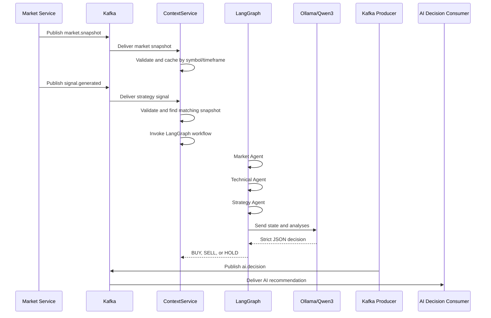
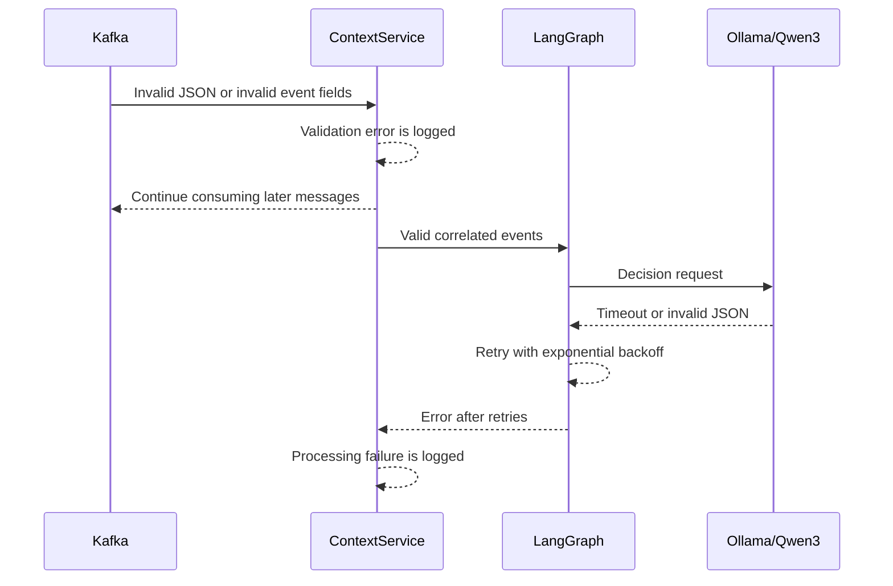

# trade-ai-service: Run and Debug Guide

This guide explains how to run and debug `trade-ai-service` from VS Code.

The service is a Python FastAPI application. It needs:

- Python 3.12
- Kafka
- Ollama
- The Qwen3 model

The unit tests do not need Kafka or Ollama, but the full Kafka flow does.

## 1. Open the Correct Folder

Open this folder as the VS Code project:

```text
/Users/amreshverma/git/trade/trade-ai-service
```

Do not open only the parent `trade` folder when using the launch profiles. The profiles use `${workspaceFolder}` as the AI service directory.

comand for run

uvicorn app.main:app --reload --port 3088

## 2. Create the Python Environment

Open the VS Code terminal and run:

```bash
python3.12 -m venv .venv
.venv/bin/pip install -r requirements.txt
cp .env.example .env
```

Select the interpreter in VS Code:

1. Press `Cmd + Shift + P`.
2. Select `Python: Select Interpreter`.
3. Select `.venv/bin/python`.

The selected interpreter should appear in the VS Code status bar.

## 3. Verify Kafka and Ollama

Kafka and Ollama are already running on your machine. The default `.env` values are:

```env
KAFKA_BOOTSTRAP_SERVERS=localhost:9092
OLLAMA_BASE_URL=http://localhost:11434
OLLAMA_MODEL=qwen3:4b
```

Download Qwen3 if it is not installed:

```bash
ollama pull qwen3:4b
```

Verify Ollama:

```bash
curl http://localhost:11434/api/tags
```

Verify Kafka is running with the Kafka CLI installed on your machine:

```bash
kafka-topics.sh --bootstrap-server localhost:9092 --list
```

The application connects to `localhost:9092` and Ollama connects to `http://localhost:11434` using the values in `.env`.

## 4. Run from VS Code

1. Open the **Run and Debug** view.
2. Select `Run trade-ai-service`.
3. Press `F5` or click the green play button.

This profile uses Uvicorn with `--reload`. It is intended for normal development.

Check the application:

```bash
curl http://localhost:3088/health
curl http://localhost:3088/ready
curl http://localhost:3088/metrics
```

Stop the application with the red stop button in the Debug toolbar or `Shift + F5`.

## 5. Debug from VS Code

Use the `Debug trade-ai-service` profile for breakpoints. This profile does not use `--reload`, so breakpoints stay in the same Python process.

1. Open **Run and Debug**.
2. Select `Debug trade-ai-service`.
3. Set a breakpoint by clicking beside a line number.
4. Press `F5`.
5. Trigger a Kafka event or call an HTTP endpoint.
6. Inspect variables in the **Variables** panel.

Useful breakpoint locations:

- `app/main.py` in `lifespan()` to inspect startup and shutdown.
- `app/services/context_service.py` in `handle_message()` to inspect Kafka payloads.
- `app/models/trading_state.py` in `from_events()` to inspect the unified state.
- `app/agents/market_agent.py` in `market_agent()` to inspect market analysis.
- `app/agents/technical_agent.py` in `technical_agent()` to inspect indicator analysis.
- `app/agents/strategy_agent.py` in `strategy_agent()` to inspect strategy alignment.
- `app/agents/decision_agent.py` in `__call__()` to inspect the LLM prompt.
- `app/llm/ollama_client.py` in `decide()` to inspect the Qwen3 response.
- `app/services/decision_service.py` in `evaluate()` to inspect the final event.

### Important debugger controls

- **Continue**: resume until the next breakpoint.
- **Step Over**: execute the current line without entering a function.
- **Step Into**: enter the function called by the current line.
- **Step Out**: finish the current function and return to its caller.
- **Restart**: restart the debug session.
- **Stop**: terminate the debug session.

## 6. Debug Tests

Select `Debug pytest` in the Run and Debug dropdown and press `F5`.

This runs the complete `tests/` directory under the debugger. You can also open a test file and use the `Debug Test` link above an individual test.

Run tests without the debugger:

```bash
.venv/bin/pytest -q
```

Current test coverage focuses on:

- Pydantic event parsing
- `TradingState` creation
- LangGraph execution with a fake decision agent
- Signal and snapshot correlation
- Health and metrics endpoints

## 7. Normal Sequence Flow



## 8. LangGraph Sequence

```mermaid
sequenceDiagram
    participant Start as START
    participant Market as Market Agent
    participant Technical as Technical Agent
    participant Strategy as Strategy Agent
    participant Decision as Decision Agent
    participant End as END
    Start->>Market: TradingState
    Market-->>Technical: market_analysis
    Technical-->>Strategy: technical_analysis
    Strategy-->>Decision: strategy_analysis
    Decision-->>End: decision, confidence, reason
```

## 9. Failure Sequence Flow



An invalid LLM response is not published to `ai.decision`. This prevents malformed recommendations from reaching downstream services.

## 10. Send a Manual Test Event

With Kafka running, open a new terminal and start a consumer for the output topic using your local Kafka CLI:

```bash
kafka-console-consumer.sh \
  --bootstrap-server localhost:9092 \
  --topic ai.decision \
  --from-beginning
```

In another terminal, publish the market snapshot:

```bash
kafka-console-producer.sh \
  --bootstrap-server localhost:9092 \
  --topic market.snapshot <<'EOF'
{"symbol":"VEDL-EQ","symbolToken":"3063","exchange":"NSE_CM","timeframe":"ONE_MINUTE","price":262.6,"trend":"BULLISH","trendStrength":"STRONG","marketRegime":"TRENDING","volumeSpike":false,"rsi14":55,"adx":31,"ema20":260,"ema50":258,"ema100":255,"ema200":245,"macd":1.2,"macdSignal":0.9,"macdHistogram":0.3,"atr":14.5,"vwap":261.3,"supertrendSignal":"BUY","pattern":"NONE","support1":258,"resistance1":272,"signalStrength":"HIGH","snapshotTime":"2026-08-20T15:30:00Z"}
EOF
```

Publish the matching strategy signal:

```bash
kafka-console-producer.sh \
  --bootstrap-server localhost:9092 \
  --topic signal.generated <<'EOF'
{"signalId":"SIG-001","symbol":"VEDL-EQ","symbolToken":"3063","timeframe":"ONE_MINUTE","strategyName":"RSI","signal":"BUY","confidence":95,"price":262.6,"reason":"RSI triggered BUY with ADX trend confirmation"}
EOF
```

The running service should consume both events, call Qwen3, and print an event in the output consumer.

## 11. Common Problems

### `ModuleNotFoundError`

The wrong Python interpreter is selected. Select `.venv/bin/python` again and reinstall dependencies:

```bash
.venv/bin/pip install -r requirements.txt
```

### Kafka connection refused

Kafka is not running or `.env` points to the wrong address. For Docker Kafka used from the host, use:

```env
KAFKA_BOOTSTRAP_SERVERS=localhost:9092
```

### Ollama connection refused

Start Ollama and verify it:

```bash
curl http://localhost:11434/api/tags
```

### `model qwen3:4b not found`

Download the model:

```bash
ollama pull qwen3:4b
```

### Breakpoint is not hit

Use `Debug trade-ai-service`, not `Run trade-ai-service`. The debug profile intentionally omits Uvicorn `--reload`.

### Port 3088 is already in use

Stop the other process or change the port in `.vscode/launch.json`:

```json
"--port",
"3089"
```

Then use `http://localhost:3089/health`.

## 12. Stop the Environment

Stop the VS Code application with `Shift + F5`.

Kafka and Ollama are managed independently, so stop them using the commands or service manager used by your local installation.

## Related Documentation

- [README.md](README.md) — setup and deployment overview
- [FLOW_DOC.md](FLOW_DOC.md) — complete service architecture and contracts
- [.vscode/launch.json](.vscode/launch.json) — VS Code run and debug profiles
